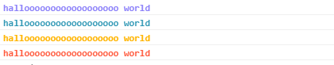
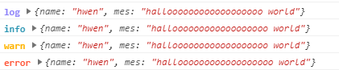

## sme-log

A lovely logs


## install

```shell
yarn install sme-log
```

or

```shell
npm install sme-log
```

## usage




- Base

```js
import logSome from 'sme-log'

// 只在 dev 环境打印 only log when NODE_ENV: 'development' or 'dev' 
window.ilog = logSome(process.env.NODE_ENV)

ilog('hallo world')

// Always log if force equal true 当 force 为 true 时，总是会打印
const force = true
ilog('hallo world~~', force)
// or
ilog('hallo world~~', 'force')

ilog({name: 'hwen', mes: 'halloooooooooooooooooo world'})
ilog.info({name: 'hwen', mes: 'halloooooooooooooooooo world'})
ilog.warn({name: 'hwen', mes: 'halloooooooooooooooooo world'})
ilog.error({name: 'hwen', mes: 'halloooooooooooooooooo world'})
```

- set level

level: 'info' || 'warn' || 'error'

```js
// window.ilog = logSome(process.env.NODE_ENV, 'info')
window.ilog = logSome(process.env.NODE_ENV, 'warn')
// window.ilog = logSome(process.env.NODE_ENV, 'error') 

// or 
ilog.setLevel('error')
```

- log name

only work for `ilog.info`, `ilog.warn`, `ilog.error`

```js
const listErr = new Error('request list 403')
ilog.error('request get list error', listErr)

const params = {}
ilog.info('request params', params)
```

**Note**: if you want to assign window, you have better change your eslint config

```js
globals: {
  'ilog': false
}
```

## Contributors

Thanks goes to these wonderful people ([emoji key](https://github.com/kentcdodds/all-contributors#emoji-key)):

<!-- ALL-CONTRIBUTORS-LIST:START - Do not remove or modify this section -->
| [<br /><sub>hwen</sub>](https://github.com/hwen)<br />[🤔](#ideas "Ideas & Planning") [💻](https://github.com/SME-FE/sme-log/commits?author=hwen "Code") [🎨](#design "Design") [📖](https://github.com/SME-FE/sme-log/commits?author=hwen "Documentation") [💡](#example "Examples") |
| :---: |
<!-- ALL-CONTRIBUTORS-LIST:END -->

## License

[MIT License](https://opensource.org/licenses/MIT)

Copyright (c) 2017-present, hwen <hwenleung@gmail.com>
